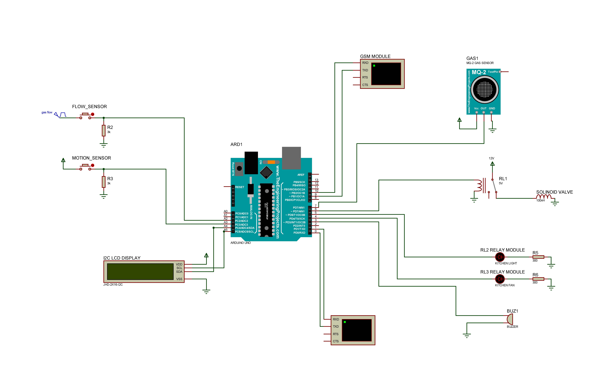

# Smart Kitchen Project: Securing Your Kitchen, Automating for Efficiency

Kitchens are an essential part of our daily lives, serving as the heart of our
homes where delicious meals are prepared and cherished memories are made.
However, the kitchen environment also poses various hazards that can lead to
accidents or even disasters. The Smart Kitchen project is a proactive solution
designed to ensure kitchen safety, provide timely notifications, and take
necessary actions when potential risks are detected. Additionally, the project
aims to enhance energy efficiency by automating devices that are often left
running, saving power and reducing unnecessary consumption This Repository
provides an overview of the project, its components, and how to set it up.

## Table of Contents

- [Smart Kitchen Project: Securing Your Kitchen, Automating for Efficiency](#smart-kitchen-project-securing-your-kitchen-automating-for-efficiency)
  - [Table of Contents](#table-of-contents)
  - [Introduction](#introduction)
    - [Why Smart Kitchen?](#why-smart-kitchen)
    - [Key Objectives](#key-objectives)
    - [How It Works](#how-it-works)
  - [Components](#components)
  - [Setup](#setup)
  - [Functionality](#functionality)
  - [Usage](#usage)
  - [Contributing](#contributing)
  - [License](#license)

## Introduction

### Why Smart Kitchen?

The Smart Kitchen project revolves around the idea of making kitchens safer and
more convenient for everyone. Traditional kitchens may lack proper monitoring
and automated control systems, making them susceptible to gas leaks, fire
hazards, or energy wastage due to forgetfulness. The Smart Kitchen addresses
these challenges with an intelligent setup that seamlessly integrates sensors,
actuators, and communication technology.

### Key Objectives

1. **Safety First**: Gas leaks and potential fire hazards are critical concerns
   in the kitchen. The Smart Kitchen project monitors gas flow and
   concentration, swiftly alerting users when dangerous levels are detected.
   This proactive approach can prevent accidents and save lives.

2. **Instant Notifications**: With the integration of a GSM module, the system
   can send SMS alerts to the homeowner's mobile phone in case of emergencies,
   even when they are away from the kitchen. This feature ensures timely
   responses to critical situations.

3. **Automated Device Control**: The project automates essential kitchen devices
   like lights and fans based on motion detection. When no movement is detected
   for a certain period, the system turns off these devices, promoting energy
   conservation and reducing electricity bills.

4. **User-Friendly Interface**: The Smart Kitchen utilizes an LCD display to
   provide real-time information about gas flow, motion detection, and other
   vital parameters. The user-friendly interface keeps homeowners informed and
   in control of their kitchen environment.

### How It Works

The Smart Kitchen project utilizes an Arduino board as its brain, equipped with
various sensors and actuators. The flow sensor monitors gas flow, while the gas
sensor continuously checks for gas concentration levels. Motion sensors detect
human presence in the kitchen. The system also includes gas valves, kitchen
light and fan relays, and an alarm buzzer to take appropriate actions when
needed.

When gas flow is detected without any motion, indicating a potential gas leak,
the system triggers an alarm, sends an alert message to the homeowner's phone,
and turns off the gas supply to prevent further risks. Similarly, when no motion
is detected for a specific duration, the system turns off lights and the fan to
conserve energy. The LCD display provides real-time updates and status
information.

## Components

The following are the key components used in the Smart Kitchen project:

-   Arduino Board (e.g., Arduino Uno)
-   Motion Sensor (PIR Sensor)
-   Gas Flow Sensor (Hall Effect flow sensor)
-   Gas Leakage & Fire Sensor (MQ2 gas sensor)
-   Gas Flow Control Valve (Solinoid Valve)
-   Relay Module
-   Alarm Buzzer
-   LCD Display (I2C)
-   GSM Module (SIM800L or similar)

## Setup

To set up the Smart Kitchen project, follow these steps:

1. **Hardware Connections**: Connect the components according to the pin
   configurations defined in the Schematics.
   

2. **Software Configuration**: Upload the provided Arduino code
   (`smart_kitchen.ino`) to your Arduino board using the Arduino IDE.

3. **GSM Module**: Ensure that the GSM module is properly connected to the
   Arduino and that you have a valid SIM card with SMS functionality.

4. **Power On**: Power up the Arduino board and the entire setup.

## Functionality

The Smart Kitchen project operates with the following logic:

-   Upon powering up, the system checks for gas flow, turns on the gas valve,
    and starts a timer.

-   The flow sensor continuously monitors gas flow. If gas flow is detected and
    no motion is detected for a certain duration, an alert is sent to the
    configured mobile number.

-   The gas flow is turned off automatically if it continues beyond a specified
    duration without any motion detected.

-   The system turns on the kitchen light and fan when motion is detected and
    turns them off when no motion is detected.

-   The gas sensor continuously checks for gas concentration. If a high gas
    concentration is detected (indicating a potential gas leak or fire), the
    alarm buzzer is activated, and an alert is sent to the configured mobile
    number.

## Usage

The Smart Kitchen project can be used to create a safer and more efficient
kitchen environment. Some points to keep in mind:

-   **Safety**: The system helps prevent gas leakage incidents and alerts users
    in case of dangerous gas concentration levels.

-   **Energy Efficiency**: The automatic control of lights and the fan based on
    motion detection helps save energy when they are not needed.

-   **Alerts**: Make sure the GSM module is configured with the correct mobile
    number to receive alerts.

## Contributing

Contributions to the Smart Kitchen project are welcome! If you find any issues,
have suggestions, or want to add new features, please feel free to open an issue
or submit a pull request.

## License

The Smart Kitchen project is licensed under the [MIT License](LICENSE).
